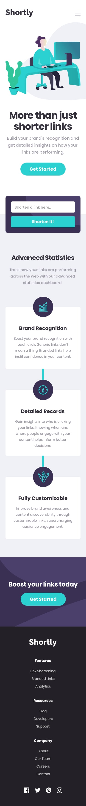

# Shortly URL shortening API by ezenardr

This is a solution to the [Shortly URL shortening API Challenge challenge on Frontend Mentor](https://www.frontendmentor.io/challenges/url-shortening-api-landing-page-2ce3ob-G).

## Table of contents

-   [Overview](#overview)
    -   [The challenge](#the-challenge)
    -   [Screenshot](#screenshot)
    -   [Links](#links)
-   [My process](#my-process)
    -   [Built with](#built-with)
-   [Author](#author)

## Overview

### The challenge

Users should be able to:

-   View the optimal layout for the site depending on their device's screen size
-   Shorten any valid URL
-   See a list of their shortened links, even after refreshing the browser
-   Copy the shortened link to their clipboard in a single click
-   Receive an error message when the `form` is submitted if:
    -   The `input` field is empty

### Screenshot

### Links

-   Live Site URL: [https://ezenardr-url-shortening.netlify.app](https://ezenardr-url-shortening.netlify.app)

## My process

### Built with

-   Semantic HTML5 markup
-   CSS custom properties
-   Flexbox
-   CSS Grid
-   Mobile-first workflow
-   [React](https://reactjs.org/) - JS library
-   [ViteJS](https://vitejs.dev) -
-   [TailwindCSS](https://tailwindcss.com) - For styles

## Author

-   Github - [ezenardr](https://github.com/ezenardr)
-   Frontend Mentor - [@ezenard](https://www.frontendmentor.io/profile/ezenardr)
-   Twitter - [@ezenardr.dev](https://www.twitter.com/ezenardr.dev)
